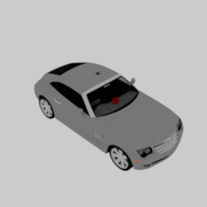

# mitsuba-shapenet-docker
Dockerfile for mitsuba-shapenet https://github.com/shi-jian/mitsuba-shapenet


## Usage
1. Build a Docker image.
```:bash
$ git clone https://github.com/aizawan/mitsuba-shapenet-docker.git
$ docker build -t mitsuba-shapenet .
```

2. Run a Docker container.
```:bash
$ docker run -it --rm -v ${PWD}:/workspace mitsuba-shapenet /bin/bash
```

3. Test for mitsuba-shapenet (in the Docker container).
```:bash
# cd /mitsuba-shapenet/shapenet
# mitsuba sample-car.xml
```
  
